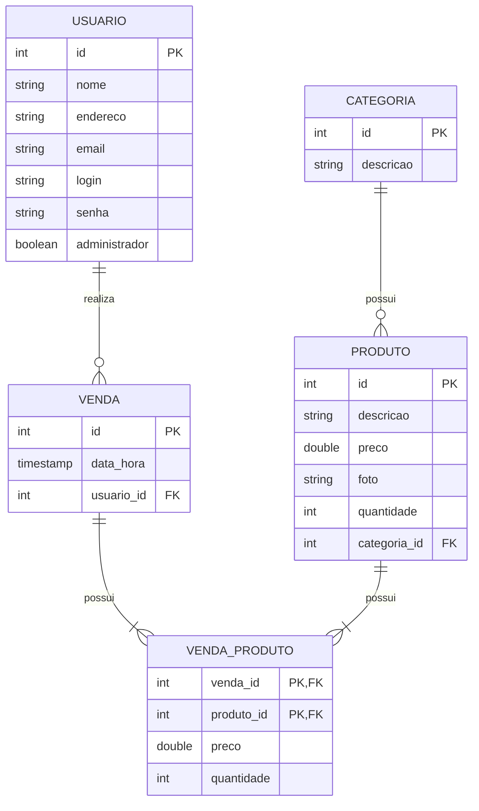

# E-commerce

## 💪 Equipe

| Foto                                                                                                                                                                                                                                        | Nome                               | Perfis profissionais                                                                               |
| ------------------------------------------------------------------------------------------------------------------------------------------------------------------------------------------------------------------------------------------- | ---------------------------------- | -------------------------------------------------------------------------------------------------- |
|                                                                                                         | CAIO LUCAS                         |                                                                                                    |
|                                                                                                         | DERIK BRAGA DE ARAUJO              |                                                                                                    |
|                                                                                                         | FELIPE GABRIEL LIMA FLORINDO       |                                                                                                    |
|                                                                                                         | JOÃO VICTOR ALVES APRIGIO          |                                                                                                    |
|                                                                                                         | PAULO VICTOR RIBEIRO NOGUEIRA LIMA |                                                                                                    |
|  | WESLEY ALVES ROLIM                 | [https://www.linkedin.com/in/wesley-alves-rolim/](https://www.linkedin.com/in/wesley-alves-rolim/) |

## 📋 Requisitos Funcionais

| ID   | Nome                     | Descrição                                                          |
| ---- | ------------------------ | ------------------------------------------------------------------ |
| RF01 | Cadastro de Cliente      | O sistema deve permitir o cadastro de novos clientes               |
| RF02 | Login de Usuário         | O sistema deve permitir autenticação de clientes e administradores |
| RF03 | Logout                   | O sistema deve permitir o encerramento da sessão                   |
| RF04 | Editar Dados             | O cliente deve poder alterar seus dados cadastrais                 |
| RF05 | Excluir Conta            | O cliente deve poder excluir sua conta                             |
| RF06 | Listar Produtos          | Exibir produtos disponíveis (estoque > 0)                          |
| RF07 | Visualizar Produto       | Exibir descrição e preço do produto                                |
| RF08 | Cadastrar Produto        | Permitir cadastro de produtos                                      |
| RF09 | Editar Produto           | Permitir edição de produtos                                        |
| RF10 | Remover Produto          | Permitir remoção de produtos                                       |
| RF11 | Gerenciar Estoque        | Permitir atualização da quantidade em estoque                      |
| RF12 | Upload de Imagem         | Permitir envio de imagem do produto                                |
| RF13 | Cadastrar Categoria      | Criar nova categoria                                               |
| RF14 | Editar Categoria         | Alterar categoria existente                                        |
| RF15 | Remover Categoria        | Excluir categoria                                                  |
| RF16 | Listar Categorias        | Exibir categorias                                                  |
| RF17 | Adicionar ao Carrinho    | Permitir adicionar produtos ao carrinho                            |
| RF18 | Remover do Carrinho      | Permitir remover produtos do carrinho                              |
| RF19 | Atualizar Quantidade     | Alterar quantidade de produtos no carrinho                         |
| RF20 | Calcular Total           | Exibir valor total da compra                                       |
| RF21 | Persistência do Carrinho | Permitir uso de cookies para armazenar carrinho                    |
| RF22 | Finalizar Compra         | Permitir finalização da compra                                     |
| RF23 | Validar Login            | Exigir autenticação para compra                                    |
| RF24 | Validar Estoque          | Verificar disponibilidade antes da compra                          |
| RF25 | Atualizar Estoque        | Atualizar estoque após compra                                      |
| RF26 | Registrar Venda          | Armazenar dados da venda                                           |
| RF27 | Visualizar Compras       | Permitir visualizar histórico de compras                           |
| RF28 | Gerenciar Carrinho       | Permitir manipulação do carrinho                                   |
| RF29 | Visualizar Compras       | Visualizar compras de todos os clientes                            |
| RF30 | Excluir Compras          | Remover compras do sistema                                         |
| RF31 | Acessar Relatórios       | Visualizar relatórios gerenciais                                   |
| RF32 | Compras por Cliente      | Exibir total de compras por cliente                                |
| RF33 | Produtos sem Estoque     | Listar produtos com estoque zerado                                 |
| RF34 | Faturamento Diário       | Exibir total de vendas por dia                                     |

## 🤝 Regras de negócio

| ID   | Regra            | Descrição                                     |
| ---- | ---------------- | --------------------------------------------- |
| RN01 | Estoque          | Produto só pode ser exibido se estoque > 0    |
| RN02 | Autenticação     | Compra só pode ser realizada com login        |
| RN03 | Limite de Compra | Não permitir compra acima do estoque          |
| RN04 | Permissão        | Apenas admins acessam funções administrativas |
| RN05 | Ordenação        | Relatórios devem seguir ordenação definida    |

## 🗄️ Banco de Dados

## 📌 Atividades

### 🎨 1. Atividades de Frontend

| ID   | Atividade                     | Descrição                                       | RF Relacionado | Responsável |
| ---- | ----------------------------- | ----------------------------------------------- | -------------- | ----------- |
| FE01 | Tela de Login                 | Criar formulário de login (email/login + senha) | RF02           | Felipe      |
| FE02 | Validação de Login            | Validar campos com JavaScript                   | RF02           | Felipe      |
| FE03 | Tela de Cadastro              | Criar formulário de cadastro de cliente         | RF01           | Felipe      |
| FE04 | Validação de Cadastro         | Validar campos obrigatórios antes do envio      | RF01           | Felipe      |
| FE05 | Tela de Perfil                | Exibir e editar dados do usuário                | RF04           | xCaio       |
| FE06 | Botão Logout                  | Implementar botão de logout                     | RF03           | xCaio       |
| FE07 | Listagem de Produtos          | Exibir produtos na página inicial               | RF06           | João Victor |
| FE08 | Card de Produto               | Mostrar descrição, preço e imagem               | RF07           | João Victor |
| FE09 | Botão "Adicionar ao Carrinho" | Permitir adicionar produto                      | RF17           | João Victor |
| FE10 | Interface de Admin (Produtos) | Tela de CRUD de produtos                        | RF08–RF10      | João Victor |
| FE11 | Upload de Imagem              | Interface para envio de imagem                  | RF12           | xCaio       |
| FE12 | Tela de Categorias            | Interface de CRUD de categorias                 | RF13–RF16      | xCaio       |
| FE13 | Tela de Carrinho              | Exibir itens adicionados                        | RF17           |             |
| FE14 | Atualizar Quantidade          | Permitir alterar quantidade                     | RF19           |             |
| FE15 | Remover Item                  | Permitir remover item                           | RF18           |             |
| FE16 | Exibir Total                  | Mostrar valor total da compra                   | RF20           |             |
| FE17 | Botão Finalizar Compra        | Acionar finalização                             | RF22           |             |
| FE18 | Histórico de Compras          | Exibir compras do cliente                       | RF27           |             |
| FE19 | Tela de Compras               | Visualizar compras de clientes                  | RF29           |             |
| FE20 | Remover Compra                | Interface para exclusão                         | RF30           |             |
| FE21 | Tela de Relatórios            | Exibir relatórios                               | RF31           |             |

### 🔌 2. Atividades de Backend

| ID   | Atividade                     | Descrição                         | RF Relacionado | Responsável  |
| ---- | ----------------------------- | --------------------------------- | -------------- | ------------ |
| BE01 | Endpoint de Cadastro          | Criar API para cadastrar cliente  | RF01           | Paulo Victor |
| BE02 | Endpoint de Login             | Autenticar usuário                | RF02           | Wesley       |
| BE03 | Gerenciamento de Sessão       | Criar e validar sessão            | RF02, RF23     | Wesley       |
| BE04 | Endpoint de Logout            | Encerrar sessão                   | RF03           | Paulo Victor |
| BE05 | Atualizar Usuário             | Editar dados do cliente           | RF04           | Derik        |
| BE06 | Excluir Usuário               | Remover conta                     | RF05           | Derik        |
| BE07 | Listar Produtos               | Retornar produtos com estoque > 0 | RF06           | Derik        |
| BE08 | Buscar Produto                | Retornar detalhes do produto      | RF07           | Paulo Victor |
| BE09 | Criar Produto                 | Inserir produto no banco          | RF08           | Wesley       |
| BE10 | Atualizar Produto             | Editar produto                    | RF09           | Derik        |
| BE11 | Deletar Produto               | Remover produto                   | RF10           | Paulo        |
| BE12 | Controle de Estoque           | Atualizar quantidade              | RF11           |              |
| BE13 | Upload de Imagem              | Salvar imagem no servidor         | RF12           | Wesley       |
| BE14 | CRUD Categorias               | Criar endpoints de categorias     | RF13–RF16      |              |
| BE15 | Gerenciar Carrinho            | API para adicionar/remover itens  | RF17–RF19      |              |
| BE16 | Calcular Total                | Calcular valor total              | RF20           |              |
| BE17 | Persistência (Cookie/Session) | Manter estado do carrinho         | RF21           |              |
| BE18 | Finalizar Compra              | Processar compra                  | RF22           |              |
| BE19 | Validar Estoque               | Verificar disponibilidade         | RF24           |              |
| BE20 | Atualizar Estoque             | Reduzir estoque após compra       | RF25           |              |
| BE21 | Registrar Venda               | Salvar venda e itens              | RF26           |              |
| BE22 | Listar Compras do Cliente     | Retornar histórico                | RF27           |              |
| BE23 | Listar Compras Gerais         | Retornar todas as compras         | RF29           |              |
| BE24 | Excluir Compra                | Remover compra                    | RF30           |              |
| BE25 | Relatório por Cliente         | Consultar compras por cliente     | RF32           |              |
| BE26 | Produtos Sem Estoque          | Consultar produtos zerados        | RF33           |              |
| BE27 | Faturamento Diário            | Calcular vendas por dia           | RF34           |              |
