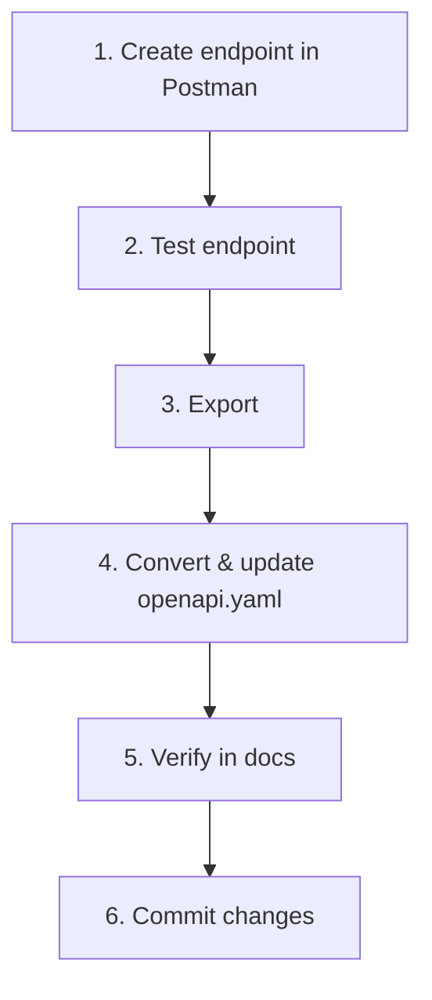

# API Documentation Server

Interactive OpenAPI documentation server for the E-Commerce API. Serves OpenAPI specifications and provides a web-based interface for browsing API endpoints.

## 🚀 Tech Stack

### Core Dependencies

- **Node.js 24**: JavaScript runtime
- **Express 5.2.1**: HTTP server framework
- **CORS 2.8.6**: Cross-origin resource sharing middleware

### Build Tools

- **npm**: Package management
- **Docker**: Containerization

## 🏗️ Repository Structure

```
api-docs/
├── infra/
│   └── dev/
│       ├── Dockerfile            # Dev Dockerfile
│       └── docker-compose.yml    # Dev compose (port 8081)
├── public/
│   ├── documentation.html        # OpenAPI UI
│   └── openapi.yaml              # OpenAPI specification
├── src/
│   └── server.js                 # Express server
├── .env.example                  # Environment template
├── Dockerfile                    # Container Dockerfile
├── package.json                  # Dependencies and scripts
└── README.md
```

## 👣 Getting Started

### Prerequisites

- **Docker**: For containerized development
- **Docker Compose**: For managing container setup

### 📊 Accessing the Documentation

```bash
docker compose -f infra/dev/docker-compose.yml up --build
```

- Api docs available at `http://localhost:8081`.
- Health check available at `http://localhost:8081/health`.

## 📚 OpenAPI Workflow

### Import from Postman

1. Open Postman
2. Click **Import** (top-left)
3. Select Link **Files** and select the `./public/openapi.yaml`
4. Inspect and test API endpoints

### Export to OpenAPI

When API endpoints change in the backend:

1. In Postman, right-click collection name → **More**
2. Choose **Export Collection**
3. Copy the exported JSON content
4. Go to <https://codeutils.app/tools/postman-to-openapi>
5. Paste JSON in left panel
6. Copy converted YAML from right panel
7. Replace `./public/openapi.yaml` with the converted content
8. Verify docs render correctly at `http://localhost:8081`
9. Commit and push changes

## 👩‍🍳 Development Recipes

### Adding a New Endpoint



To document a new endpoint:

1. **Postman**: Create and test the endpoint in your collection
2. **Verify**: Test works as expected
3. **Export**: Right-click collection → More → Export Collection
4. **Convert**: Use <https://codeutils.app/tools/postman-to-openapi> to convert JSON → YAML
5. **Update**: Replace `public/openapi.yaml` with converted YAML
6. **Verify Rendering**: Visit `http://localhost:8081` and confirm endpoint appears
7. **Commit**: Commit the updated `openapi.yaml`

### Syncing with Backend API

When the backend API changes:

1. Update endpoints in Postman to match the new backend
2. Right-click collection → More → Export Collection
3. Convert JSON to YAML using <https://codeutils.app/tools/postman-to-openapi>
4. Replace `public/openapi.yaml` with converted YAML
5. Test locally: `docker compose -f infra/dev/docker-compose.yml up`
6. Push changes to repository

## 🏥 Health Check

Monitor server status:

```bash
curl http://localhost:8081/health
```

Returns:

```json
{ "status": "ok" }
```
