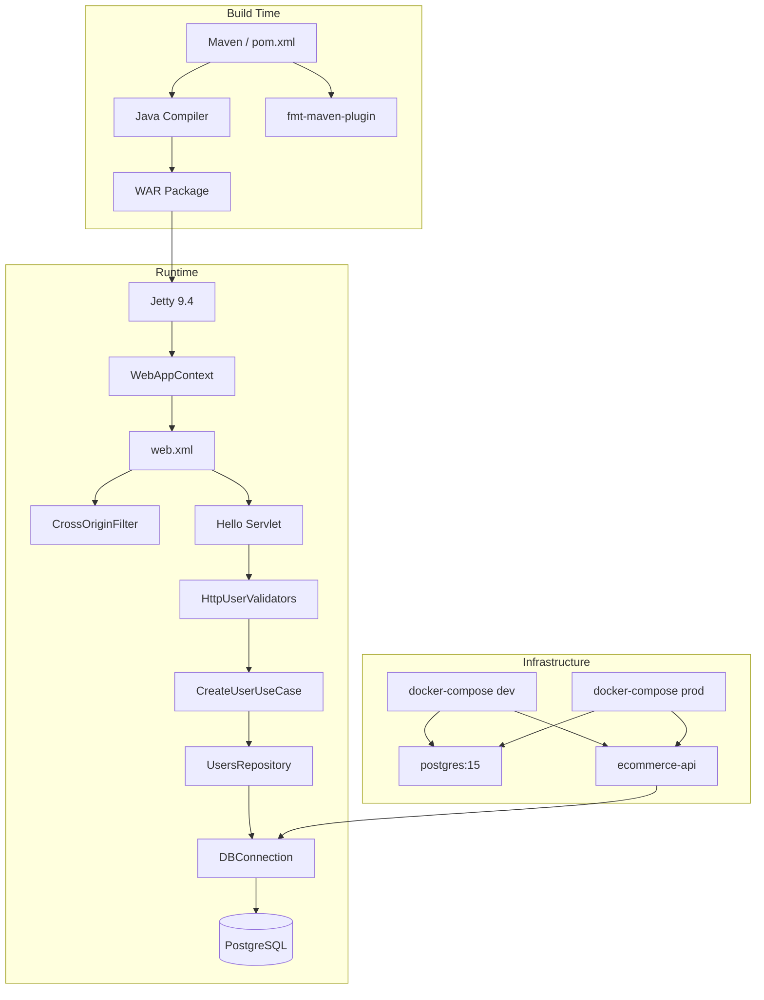
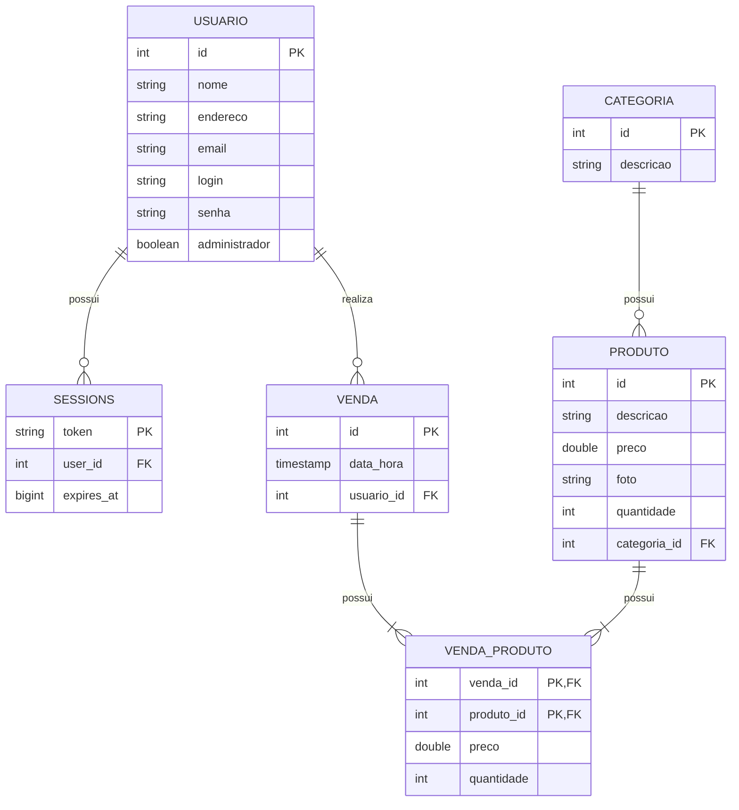
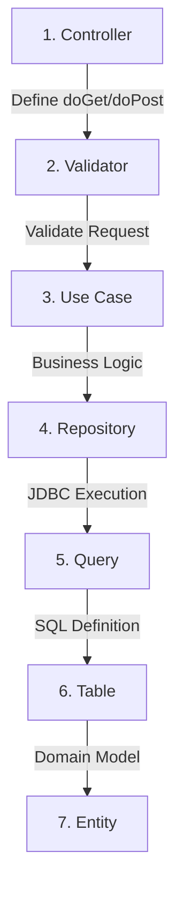
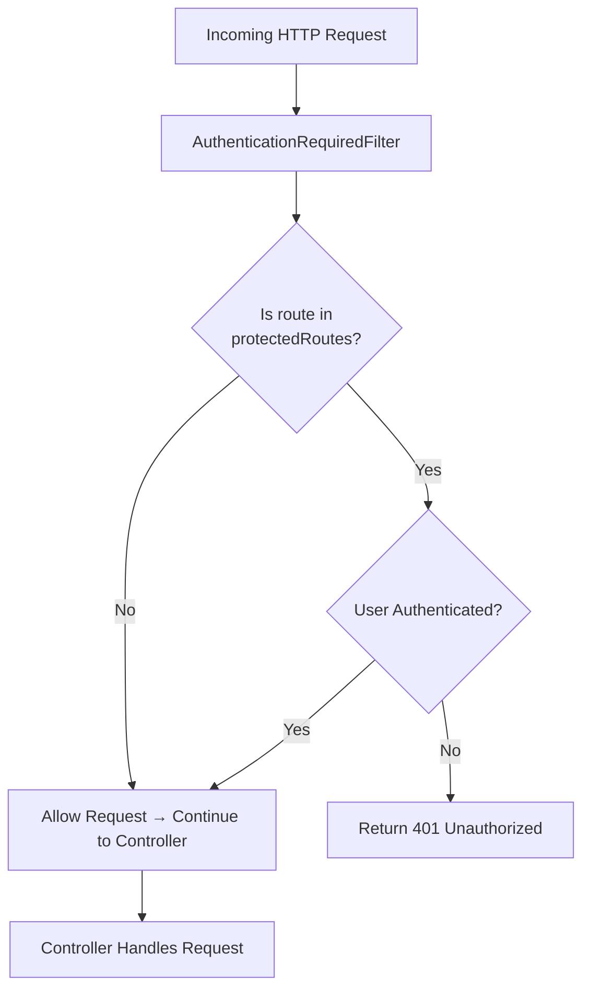
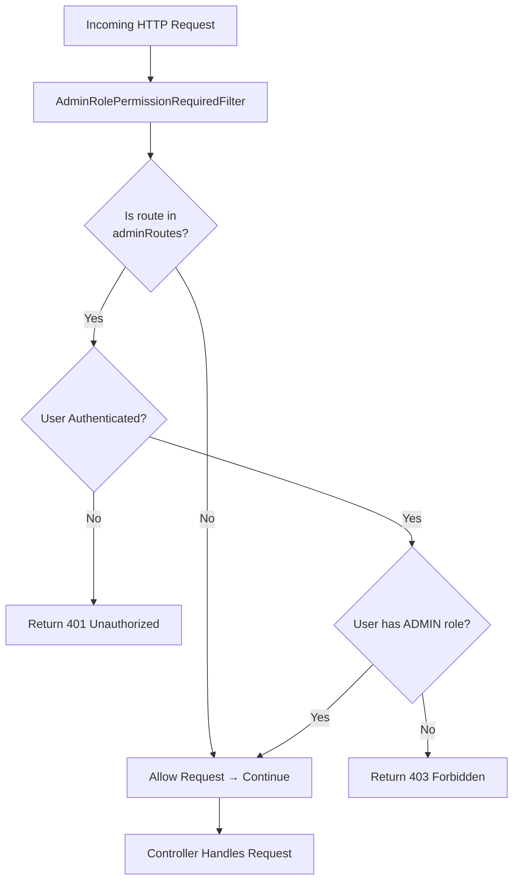

# Ecommerce API

## 🏗️ Architecture



### 🫀 Core Modules

| Module           | Location                                             | Responsibility               |
| ---------------- | ---------------------------------------------------- | ---------------------------- |
| **Controllers**  | `src/main/java/ecommerce/Http/Controller/`           | HTTP servlet handlers        |
| **Validators**   | `src/main/java/ecommerce/Http/Validators/`           | Request input validation     |
| **Use Cases**    | `src/main/java/ecommerce/UseCases/`                  | Business logic orchestration |
| **Repositories** | `src/main/java/ecommerce/Database/Repositories/`     | Database queries             |
| **Entities**     | `src/main/java/ecommerce/Database/Entites/`          | Domain models                |
| **Queries**      | `src/main/java/ecommerce/Database/Queries/`          | Raw SQL statements           |
| **Database**     | `src/main/java/ecommerce/Database/DBConnection.java` | Singleton JDBC connection    |
| **Exceptions**   | `src/main/java/ecommerce/Exceptions/`                | Custom exception types       |
| **Tables**       | `src/main/java/ecommerce/Database/Tables/`           | SQL table definitions        |

## 🚀 Tech Stack

### Core Dependencies

- **Java 17**: Language runtime
- **Jetty 9.4**: Embedded servlet container
- **PostgreSQL 42.7.2**: JDBC driver for database access
- **Jackson 2.8.1**: JSON serialization/deserialization
- **Gson 2.10.1**: JSON entity serialization

### Build Tools

- **Maven 3.9.6**: Build and dependency management
- **fmt-maven-plugin 2.25**: Google Java Format enforcement

## 🏗️ Repository Structure

```
api/
├── infra/
│   ├── dev/
│   │   ├── Dockerfile            # Dev Dockerfile (with format check)
│   │   └── docker-compose.yml    # Dev compose (port 8080)
│   └── prod/
│       ├── Dockerfile            # Prod Dockerfile (skips tests)
│       └── docker-compose.yml    # Prod compose (port 80)
├── src/
│   └── main/
│       ├── java/ecommerce/
│       │   ├── Database/
│       │   │   ├── Entites/      # Domain models (User)
│       │   │   ├── Queries/      # SQL query constants
│       │   │   ├── Repositories/ # Data access layer
│       │   │   ├── Tables/       # SQL table definitions
│       │   │   └── DBConnection.java
│       │   ├── Exceptions/       # Custom exceptions
│       │   ├── Http/
│       │   │   ├── Controller/   # Servlet controllers
│       │   │   ├── Filter/       # HTTP filters (e.g. auth)
│       │   │   └── Validators/   # Input validators
│       │   └── UseCases/         # Business logic
│       └── webapp/
│           └── WEB-INF/
│               └── web.xml       # Servlet and filter configuration
├── pom.xml
└── README.md
```

## 👣 Getting Started

### Prerequisites

- **Java 17** + **Maven 3.9.6**: Only if running locally without Docker
- **WLS2**: For Windows users only. Required to run Docker.
- **Docker**: For containerized development and deployment
- **Docker Compose**: For managing multi-container setups

### Development

Start the dev environment:

```bash
docker compose -f infra/dev/docker-compose.yml up --build
```

- Api is available at `http://localhost:8080`.
- PgAdmin is available at `http://localhost:5050`.

### Code Quality

```bash
mvn fmt:check    # Check Google Java Format compliance
mvn fmt:format   # Auto-format all Java source files
mvn package      # Build WAR (runs format check)
```

### Environment Variables

| Variable      | Default                                            | Description         |
| ------------- | -------------------------------------------------- | ------------------- |
| `DB_URL`      | `jdbc:postgresql://postgres:5432/ecommerceproject` | JDBC connection URL |
| `DB_USER`     | `postgres`                                         | Database user       |
| `DB_PASSWORD` | `ecommerce_secret_password_123`                    | Database password   |

## 🗄️ Database



## 🛫 Deployment

### Production

```bash
docker compose -f infra/prod/docker-compose.yml up -d --build
```

Available at `http://localhost:80`.

## 👩‍🍳 Development Recipes

### Adding a New Feature



To implement a new feature or endpoint, follow this structured process:

1.  **Controller** (`ecommerce.Http.Controller`): Create or update a servlet.
    - Annotate with `@WebServlet("/path")`.
    - Implement `doGet`, `doPost`, `doPut`, or `doDelete`.
2.  **Validator** (`ecommerce.Http.Validators`): Create an input validator if needed.
    - Extract parameters from `HttpServletRequest`.
    - Throw `ValidationException` for invalid data.
    - Return a clean object or the original data if valid.
3.  **Use Case** (`ecommerce.UseCases`): Define the business logic.
    - Orchestrate calls between repositories.
    - Handle complex logic that doesn't belong in the controller or repository.
4.  **Repository** (`ecommerce.Database.Repositories`): Create a data access class.
    - Use `DBConnection.getConnection()` to interact with the database.
    - Map ResultSet rows to Entity objects.
5.  **Query** (`ecommerce.Database.Queries`): Define raw SQL constants.
    - Keep SQL strings centralized in dedicated query classes.
6.  **Table** (`ecommerce.Database.Tables`): Create the `.sql` file for the table.
    - Define the schema (schema, types, constraints).
7.  **Entity** (`ecommerce.Database.Entites`): Create the Java representation of the data.
    - Include getters/setters and JSON serialization logic (e.g., `toJson()` method).
8.  **Initialization**: Ensure the new table is registered in `Database.DatabaseInitializer.java` to be created on startup if it doesn't exist.


### Protect Routes from Unauthenticated Users



To protect an endpoint and restrict access to authenticated users, follow the steps below:

#### 1. Update the Authentication Filter

Modify the filter responsible for handling authentication:

* Open `ecommerce.http.filter.AuthenticationRequiredFilter.java`
* This filter intercepts incoming requests and checks whether authentication is required.

#### 2. Register the Protected Route

Define which routes should require authentication:

* Locate the `protectedRoutes` list inside the filter.
* Add a new route entry specifying the HTTP method and path.

**Example:**

If you want to protect a `GET` endpoint at `/admin/dashboard`, add:

```java
new Route("GET", "/admin/dashboard")
```

#### 3. Done

Once the route is added to `protectedRoutes`, the filter will automatically enforce authentication for that endpoint.


### Protect Routes with Admin Role Permission



To restrict access to endpoints that require **administrator privileges**, follow the steps below:

#### 1. Update the Admin Role Filter

Modify the filter responsible for enforcing admin permissions:

* Open `ecommerce.Http.Filter.AdminRolePermissionRequiredFilter.java`
* This filter intercepts incoming requests and validates:

  * If the route requires admin access
  * If the user is authenticated
  * If the user has the `administrator=true`

#### 2. Register Admin-Protected Routes

Define which routes should only be accessible by admin users:

* Locate the `adminRoutes` list inside the filter
* Add a new route entry specifying the HTTP method and path

**Example:**

To protect a `POST` endpoint at `/admin/products`, add:

```java
new Route("POST", "/admin/products")
```

#### 3. Done

Once configured, the filter ensures that the user has `administrador = true` in the database to access this endpoint.
