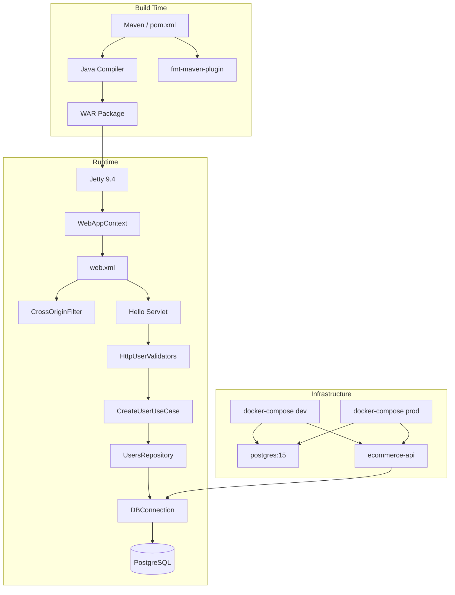

# Ecommerce API

## Architecture



### Core Modules

| Module | Location | Responsibility |
|--------|----------|----------------|
| **Controllers** | `src/main/java/ecommerce/Http/Controller/` | HTTP servlet handlers |
| **Validators** | `src/main/java/ecommerce/Http/Validators/` | Request input validation |
| **Use Cases** | `src/main/java/ecommerce/UseCases/` | Business logic orchestration |
| **Repositories** | `src/main/java/ecommerce/Database/Repositories/` | Database queries |
| **Entities** | `src/main/java/ecommerce/Database/Entites/` | Domain models |
| **Queries** | `src/main/java/ecommerce/Database/Queries/` | Raw SQL statements |
| **Database** | `src/main/java/ecommerce/Database/DBConnection.java` | Singleton JDBC connection |
| **Exceptions** | `src/main/java/ecommerce/Exceptions/` | Custom exception types |
| **Tables** | `src/main/java/ecommerce/Database/Tables/` | SQL table definitions |

## Tech Stack

### Core Dependencies

- **Java 17**: Language runtime
- **Jetty 9.4**: Embedded servlet container
- **PostgreSQL 42.7.2**: JDBC driver for database access
- **Jackson 2.8.1**: JSON serialization/deserialization
- **Gson 2.10.1**: JSON entity serialization

### Build Tools

- **Maven 3.9.6**: Build and dependency management
- **fmt-maven-plugin 2.25**: Google Java Format enforcement

## Repository Structure

```
api/
├── infra/
│   ├── dev/
│   │   ├── Dockerfile            # Dev Dockerfile (with format check)
│   │   └── docker-compose.yml    # Dev compose (port 8080)
│   └── prod/
│       ├── Dockerfile            # Prod Dockerfile (skips tests)
│       └── docker-compose.yml    # Prod compose (port 80)
├── src/
│   └── main/
│       ├── java/ecommerce/
│       │   ├── Database/
│       │   │   ├── Entites/      # Domain models (User)
│       │   │   ├── Queries/      # SQL query constants
│       │   │   ├── Repositories/ # Data access layer
│       │   │   ├── Tables/       # SQL table definitions
│       │   │   └── DBConnection.java
│       │   ├── Exceptions/       # Custom exceptions
│       │   ├── Http/
│       │   │   ├── Controller/   # Servlet controllers
│       │   │   ├── Filter/       # HTTP filters (e.g. auth)
│       │   │   └── Validators/   # Input validators
│       │   └── UseCases/         # Business logic
│       └── webapp/
│           └── WEB-INF/
│               └── web.xml       # Servlet and filter configuration
├── pom.xml
└── README.md
```

## Getting Started

### Prerequisites

- **Docker**: For containerized development and deployment
- **Docker Compose**: For managing multi-container setups
- **Java 17** + **Maven 3.9.6**: Only if running locally without Docker

### Development

Start the dev environment:

```bash
docker compose -f infra/dev/docker-compose.yml up --build
```

Available at `http://localhost:8080`.

### Environment Variables

| Variable | Default | Description |
|----------|---------|-------------|
| `DB_URL` | `jdbc:postgresql://postgres:5432/ecommerceproject` | JDBC connection URL |
| `DB_USER` | `postgres` | Database user |
| `DB_PASSWORD` | `ecommerce_secret_password_123` | Database password |

### Code Quality

```bash
mvn fmt:check    # Check Google Java Format compliance
mvn fmt:format   # Auto-format all Java source files
mvn package      # Build WAR (runs format check)
```

## API Endpoints

| Method | Path | Description |
|--------|------|-------------|
| `GET` | `/` | Health check — returns `{"message": "Hello, World!"}` |
| `POST` | `/` | Create a user |

### POST `/` — Create User

**Request params (form-encoded):**

| Field | Required | Description |
|-------|----------|-------------|
| `name` | yes | User full name |
| `address` | yes | User address |
| `email` | yes | User email (unique) |
| `login` | yes | Username (unique) |
| `password` | yes | Plain-text password |

**Response:** JSON representation of the created user.

## Database

### Users Table

```sql
CREATE TABLE usuario (
    id            SERIAL PRIMARY KEY,
    nome          VARCHAR(255) NOT NULL,
    endereco      TEXT,
    email         VARCHAR(255) UNIQUE NOT NULL,
    login         VARCHAR(100) UNIQUE NOT NULL,
    senha         TEXT NOT NULL,
    administrador BOOLEAN NOT NULL DEFAULT FALSE
);
```

## Deployment

### Production

```bash
docker compose -f infra/prod/docker-compose.yml up -d --build
```

Available at `http://localhost:80`.
