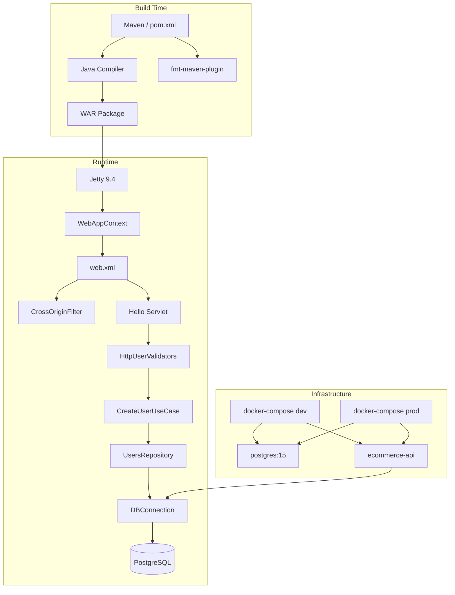
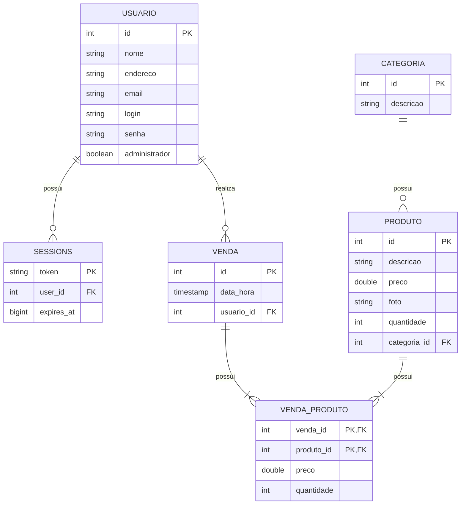
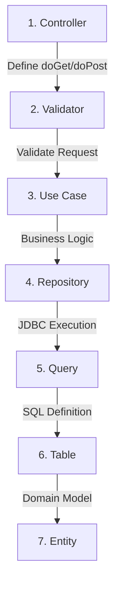
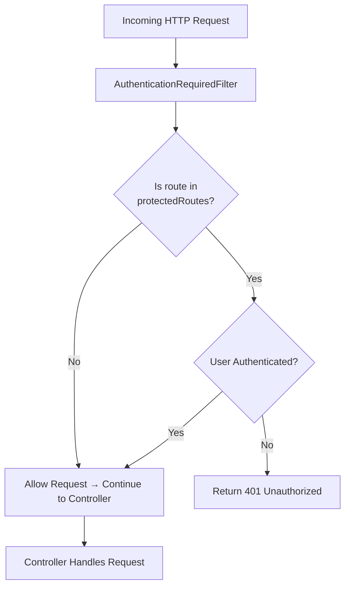
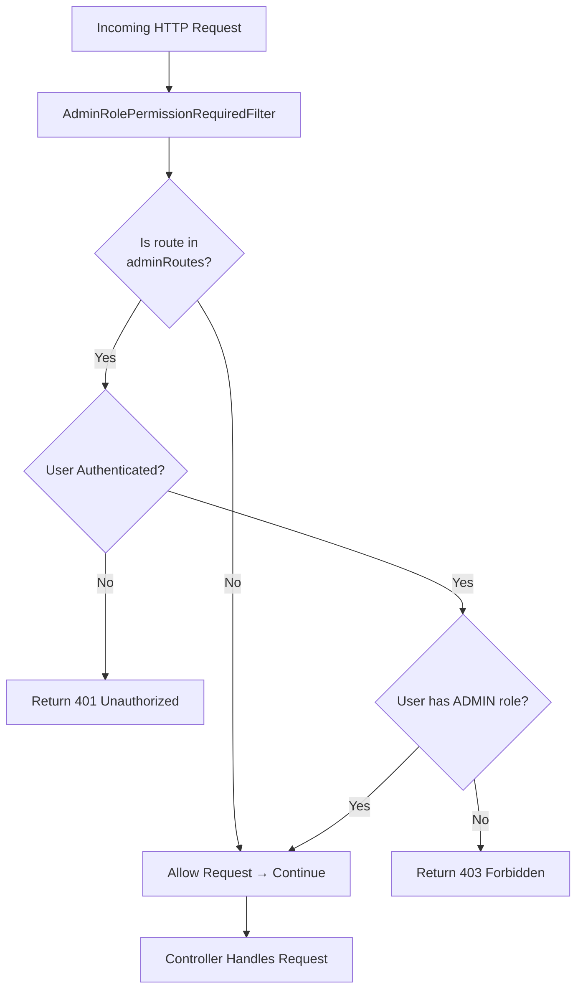

# Ecommerce API

## 🏗️ Architecture


```mermaid
graph TB
    subgraph "Build Time"
        A[Maven / pom.xml] --> B[Java Compiler]
        A --> C[fmt-maven-plugin]
        B --> D[WAR Package]
    end

    subgraph "Runtime"
        E[Jetty 9.4] --> F[WebAppContext]
        F --> G[web.xml]
        G --> H[CrossOriginFilter]
        G --> I[Hello Servlet]
        I --> J[HttpUserValidators]
        J --> K[CreateUserUseCase]
        K --> L[UsersRepository]
        L --> M[DBConnection]
        M --> N[(PostgreSQL)]
    end

    subgraph "Infrastructure"
        O[docker-compose dev] --> P[postgres:15]
        O --> Q[ecommerce-api]
        R[docker-compose prod] --> P
        R --> Q
    end

    D --> E
    Q --> M
```

### 🫀 Core Modules

| Module           | Location                                             | Responsibility               |
| ---------------- | ---------------------------------------------------- | ---------------------------- |
| **Controllers**  | `src/main/java/ecommerce/Http/Controller/`           | HTTP servlet handlers        |
| **Validators**   | `src/main/java/ecommerce/Http/Validators/`           | Request input validation     |
| **Use Cases**    | `src/main/java/ecommerce/UseCases/`                  | Business logic orchestration |
| **Repositories** | `src/main/java/ecommerce/Database/Repositories/`     | Database queries             |
| **Entities**     | `src/main/java/ecommerce/Database/Entites/`          | Domain models                |
| **Queries**      | `src/main/java/ecommerce/Database/Queries/`          | Raw SQL statements           |
| **Database**     | `src/main/java/ecommerce/Database/DBConnection.java` | Singleton JDBC connection    |
| **Exceptions**   | `src/main/java/ecommerce/Exceptions/`                | Custom exception types       |
| **Tables**       | `src/main/java/ecommerce/Database/Tables/`           | SQL table definitions        |

## 🚀 Tech Stack

### Core Dependencies

- **Java 17**: Language runtime
- **Jetty 9.4**: Embedded servlet container
- **PostgreSQL 42.7.2**: JDBC driver for database access
- **Jackson 2.8.1**: JSON serialization/deserialization
- **Gson 2.10.1**: JSON entity serialization

### Build Tools

- **Maven 3.9.6**: Build and dependency management
- **fmt-maven-plugin 2.25**: Google Java Format enforcement

## 🏗️ Repository Structure

```
api/
├── infra/
│   ├── dev/
│   │   ├── Dockerfile            # Dev Dockerfile (with format check)
│   │   └── docker-compose.yml    # Dev compose (port 8080)
│   └── prod/
│       ├── Dockerfile            # Prod Dockerfile (skips tests)
│       └── docker-compose.yml    # Prod compose (port 80)
├── src/
│   └── main/
│       ├── java/ecommerce/
│       │   ├── Database/
│       │   │   ├── Entites/      # Domain models (User)
│       │   │   ├── Queries/      # SQL query constants
│       │   │   ├── Repositories/ # Data access layer
│       │   │   ├── Seeds/        # Initial and mock database data
│       │   │   ├── Tables/       # SQL table definitions
│       │   │   └── DBConnection.java
│       │   ├── Exceptions/       # Custom exceptions
│       │   ├── Http/
│       │   │   ├── Controller/   # Servlet controllers
│       │   │   ├── Filter/       # HTTP filters (e.g. auth)
│       │   │   ├── IO/
│       │   │   │   ├── Requests/   # Request DTOs
│       │   │   │   └── Responses/  # Response DTOs
│       │   │   └── Validators/   # Input validators
│       │   └── UseCases/         # Business logic
│       └── webapp/
│           └── WEB-INF/
│               └── web.xml       # Servlet and filter configuration
├── pom.xml
└── README.md
```

## 👣 Getting Started

### Prerequisites

- **Java 17** + **Maven 3.9.6**: Only if running locally without Docker
- **WLS2**: For Windows users only. Required to run Docker.
- **Docker**: For containerized development and deployment
- **Docker Compose**: For managing multi-container setups

### Development

Start the dev environment:

```bash
docker compose -f infra/dev/docker-compose.yml up --build
```

- Api is available at `http://localhost:8080`.
- PgAdmin is available at `http://localhost:5050`.

Seed the database:

```bash
docker exec -it postgres-ecommerce-dev psql -U postgres -d ecommerceproject -f /tmp/seeds.sql
```

### Code Quality

```bash
mvn fmt:check    # Check Google Java Format compliance
mvn fmt:format   # Auto-format all Java source files
mvn package      # Build WAR (runs format check)
```

### Environment Variables

| Variable      | Default                                            | Description         |
| ------------- | -------------------------------------------------- | ------------------- |
| `DB_URL`      | `jdbc:postgresql://postgres:5432/ecommerceproject` | JDBC connection URL |
| `DB_USER`     | `postgres`                                         | Database user       |
| `DB_PASSWORD` | `ecommerce_secret_password_123`                    | Database password   |

## 🗄️ Database


```mermaid
erDiagram
    USUARIO {
        int id PK
        string nome
        string endereco
        string email
        string login
        string senha
        boolean administrador
    }

    CATEGORIA {
        int id PK
        string descricao
    }

    PRODUTO {
        int id PK
        string descricao
        double preco
        string foto
        int quantidade
        int categoria_id FK
    }

    VENDA {
        int id PK
        timestamp data_hora
        int usuario_id FK
    }

    VENDA_PRODUTO {
        int venda_id PK, FK
        int produto_id PK, FK
        double preco
        int quantidade
    }

    SESSIONS {
        string token PK
        int user_id FK
        bigint expires_at
    }

    USUARIO ||--o{ SESSIONS : "possui"
    USUARIO ||--o{ VENDA : "realiza"
    CATEGORIA ||--o{ PRODUTO : "possui"
    VENDA ||--|{ VENDA_PRODUTO : "possui"
    PRODUTO ||--|{ VENDA_PRODUTO : "possui"
```

## 🛫 Deployment

### Production

```bash
docker compose -f infra/prod/docker-compose.yml up -d --build
```

Available at `http://localhost:80`.

## 👩‍🍳 Development Recipes

### Adding a New Feature


```mermaid
flowchart TD
    A[1. Controller] -->|Define doGet/doPost| B[2. Validator]
    B -->|Validate Request| C[3. Use Case]
    C -->|Business Logic| D[4. Repository]
    D -->|JDBC Execution| E[5. Query]
    E -->|SQL Definition| F[6. Table]
    F -->|Domain Model| G[7. Entity]
```

To implement a new feature or endpoint, follow this structured process:

1. **Controller** (`ecommerce.Http.Controller`): Create or update a servlet.
    - Annotate with `@WebServlet("/path")`.
    - Implement `doGet`, `doPost`, `doPut`, or `doDelete`.
2. **Validator** (`ecommerce.Http.Validators`): Create an input validator if needed.
    - Extract parameters from `HttpServletRequest`.
    - Throw `ValidationException` for invalid data.
    - Return a clean object or the original data if valid.
3. **Use Case** (`ecommerce.UseCases`): Define the business logic.
    - Orchestrate calls between repositories.
    - Handle complex logic that doesn't belong in the controller or repository.
4. **Repository** (`ecommerce.Database.Repositories`): Create a data access class.
    - Use `DBConnection.getConnection()` to interact with the database.
    - Map ResultSet rows to Entity objects.
5. **Query** (`ecommerce.Database.Queries`): Define raw SQL constants.
    - Keep SQL strings centralized in dedicated query classes.
6. **Table** (`ecommerce.Database.Tables`): Create the `.sql` file for the table.
    - Define the schema (schema, types, constraints).
7. **Entity** (`ecommerce.Database.Entites`): Create the Java representation of the data.
    - Include getters/setters and JSON serialization logic (e.g., `toJson()` method).
8. **Initialization**: Ensure the new table is registered in `Database.DatabaseInitializer.java` to be created on startup if it doesn't exist.

### Protect Routes from Unauthenticated Users


```mermaid
flowchart TD
    A[Incoming HTTP Request] --> B[AuthenticationRequiredFilter]

    B --> C{Is route in\nprotectedRoutes?}

    C -- No --> D[Allow Request → Continue to Controller]

    C -- Yes --> E{User Authenticated?}

    E -- Yes --> D
    E -- No --> F[Return 401 Unauthorized]

    D --> G[Controller Handles Request]
```

To protect an endpoint and restrict access to authenticated users, follow the steps below:

#### 1. Update the Authentication Filter

Modify the filter responsible for handling authentication:

- Open `ecommerce.http.filter.AuthenticationRequiredFilter.java`
- This filter intercepts incoming requests and checks whether authentication is required.

#### 2. Register the Protected Route

Define which routes should require authentication:

- Locate the `protectedRoutes` list inside the filter.
- Add a new route entry specifying the HTTP method and path.

**Example:**

If you want to protect a `GET` endpoint at `/admin/dashboard`, add:

```java
new Route("GET", "/admin/dashboard")
```

#### 3. Done

Once the route is added to `protectedRoutes`, the filter will automatically enforce authentication for that endpoint.

### Protect Routes with Admin Role Permission


```mermaid
flowchart TD
    A[Incoming HTTP Request] --> B[AdminRolePermissionRequiredFilter]

    B --> C{Is route in\nadminRoutes?}

    C -- No --> D[Allow Request → Continue]

    C -- Yes --> E{User Authenticated?}

    E -- No --> F[Return 401 Unauthorized]

    E -- Yes --> G{User has ADMIN role?}

    G -- No --> H[Return 403 Forbidden]

    G -- Yes --> D

    D --> I[Controller Handles Request]
```

To restrict access to endpoints that require **administrator privileges**, follow the steps below:

#### 1. Update the Admin Role Filter

Modify the filter responsible for enforcing admin permissions:

- Open `ecommerce.Http.Filter.AdminRolePermissionRequiredFilter.java`
- This filter intercepts incoming requests and validates:
  - If the route requires admin access
  - If the user is authenticated
  - If the user has the `administrator=true`

#### 2. Register Admin-Protected Routes

Define which routes should only be accessible by admin users:

- Locate the `adminRoutes` list inside the filter
- Add a new route entry specifying the HTTP method and path

**Example:**

To protect a `POST` endpoint at `/admin/products`, add:

```java
new Route("POST", "/admin/products")
```

#### 3. Done

Once configured, the filter ensures that the user has `administrador = true` in the database to access this endpoint.

### Handling Request Parameters

This API uses multiple parameter types depending on the endpoint. Follow these recipes for each type:

#### 1. Body Parameters (JSON)

**When to use:** Create or update operations with structured data

**Helper:** `BodyJsonToObject.parse(request, ClassName.class)`

**Example:**

```java
// Controller
@WebServlet("/login")
public class LoginController extends HttpServlet {
  protected void doPost(HttpServletRequest request, HttpServletResponse response) {
    // 1. Parse the body into a DTO
    LoginBodyRequest body = BodyJsonToObject.parse(request, LoginBodyRequest.class);

    // 2. Validate the body
    HttpLoginValidators validators = new HttpLoginValidators();
    User credentials = validators.validateLogin(request);

    // 3. Use the validated data
    LoginUseCase useCase = new LoginUseCase();
    LoginUseCase.LoginResult result = useCase.execute(credentials.getLogin(), credentials.getSenha());
  }
}

// DTO (Request model)
public class LoginBodyRequest {
  public String login;
  public String password;
}

// Validator
public class HttpLoginValidators {
  public User validateLogin(HttpServletRequest request) throws ValidationException {
    LoginBodyRequest body = BodyJsonToObject.parse(request, LoginBodyRequest.class);
    // Validate fields
    if (body.login == null || body.login.isEmpty()) {
      throw new ValidationException("Login is required");
    }
    // ... more validation
    return user;
  }
}
```

#### 2. Path Variables (Dynamic URL segments)

**When to use:** Identify specific resources (like `/users/42` or `/cart/67`)

**Helper:** `PathVariableExtractor.extract(request, pattern, varName)`

**Example:**

```java
// Controller - Update route to accept wildcard
@WebServlet("/cart/*")
public class CartController extends HttpServlet {
  protected void doDelete(HttpServletRequest request, HttpServletResponse response) {
    // 1. Extract path variable using helper
    int productId = PathVariableExtractor.extractIntPathVariable(
      request,
      "/cart/:productId",
      "productId"
    );

    // 2. Use the extracted variable
    RemoveItemFromCartUseCase useCase = new RemoveItemFromCartUseCase();
    Cart cart = useCase.execute(rawCart, productId);
  }
}
```

**Supported extraction methods:**

```java
// Extract string variable
String filename = PathVariableExtractor.extractPathVariable(
  request,
  "/image/:filename",
  "filename"
);

// Extract integer variable
int userId = PathVariableExtractor.extractIntPathVariable(
  request,
  "/users/:userId",
  "userId"
);

// Extract long variable
long postId = PathVariableExtractor.extractLongPathVariable(
  request,
  "/posts/:postId",
  "postId"
);

// Extract multiple variables at once
Map<String, String> vars = PathVariableExtractor.extractPathVariables(
  request,
  "/users/:userId/posts/:postId"
);
String userId = vars.get("userId");
String postId = vars.get("postId");
```

**Pattern Syntax:**

- `:id` - Simple variable
- `:userId` or `:user_id` - Named variables (underscore allowed)
- `/users/:userId/posts/:postId` - Multiple variables

#### 3. Query Parameters

**When to use:** Optional filters, pagination, or configuration values

**How to extract:**

```java
String value = request.getParameter("paramName");
String[] values = request.getParameterValues("paramName"); // For multiple values
int page = Integer.parseInt(request.getParameter("page"));
```

**Example:**

```java
// Controller
@WebServlet("/products")
public class ProductController extends HttpServlet {
  protected void doGet(HttpServletRequest request, HttpServletResponse response) {
    // Extract optional query parameters
    String category = request.getParameter("category");
    String sortBy = request.getParameter("sort");
    String pageStr = request.getParameter("page");

    int page = pageStr != null ? Integer.parseInt(pageStr) : 1;

    // Use the parameters
    ListProductsUseCase useCase = new ListProductsUseCase();
    List<Product> products = useCase.execute(category, sortBy, page);
  }
}
```

#### 4. Request Attributes (From Filters)

**When to use:** Pass data from filters/middleware to controllers (authenticated user, request context)

**How to set (in filter):**

```java
User authenticatedUser = getUserFromToken(token);
request.setAttribute("user", authenticatedUser);
```

**How to extract (in controller):**

```java
User user = (User) request.getAttribute("user");
```

**Example:**

```java
// Filter sets the authenticated user
public class AuthenticationFilter extends HttpFilter {
  protected void doFilter(HttpServletRequest request, HttpServletResponse response, FilterChain chain) {
    String token = extractToken(request);
    User user = validateToken(token);
    request.setAttribute("user", user); // Set for controller
    chain.doFilter(request, response);
  }
}

// Controller reads the authenticated user
@WebServlet("/me")
public class AuthMeController extends HttpServlet {
  protected void doGet(HttpServletRequest request, HttpServletResponse response) {
    User user = (User) request.getAttribute("user"); // Already set by filter
    JsonResponse jsonRes = new JsonResponse(HttpServletResponse.SC_OK, "User info", user);
    response.getWriter().write(jsonRes.toJson());
  }
}
```

### Exporting Data as File

Use `DataArrayConverter` to serialize any entity list as HTML, plain text (CSV) or PDF and stream it as a file download.

**Supported MIME types:**

| `mimetype`        | Output       | File extension |
| ----------------- | ------------ | -------------- |
| `text/html`       | HTML table   | `.html`        |
| `text/plain`      | CSV          | `.csv`         |
| `application/pdf` | PDF table    | `.pdf`         |

**Example:**

```java
@WebServlet("/products")
public class ProductController extends HttpServlet {
  protected void doGet(HttpServletRequest request, HttpServletResponse response)
      throws IOException {

    ListProductsUseCase useCase = new ListProductsUseCase();
    String baseUrl = request.getScheme() + "://" + request.getServerName() + ":" + request.getServerPort();
    List<Product> products = useCase.execute(baseUrl);

    String mimetype = "application/pdf"; // or "text/html" / "text/plain"
    String extension = "pdf";            // match the mimetype above

    byte[] bytes = DataArrayConverter.convert(products, Product.class, mimetype);
    response.setContentType(mimetype);
    response.setContentLength(bytes.length);
    response.setHeader("Content-Disposition", "attachment; filename=\"products." + extension + "\"");

    try (ServletOutputStream out = response.getOutputStream()) {
      out.write(bytes);
    }
  }
}
```

`DataArrayConverter.convert` reflects all declared fields of the entity class — no extra configuration needed.

To add a new format, implement `DataArrayConverterStrategy` and register it in the `switch` inside `DataArrayConverter`.
