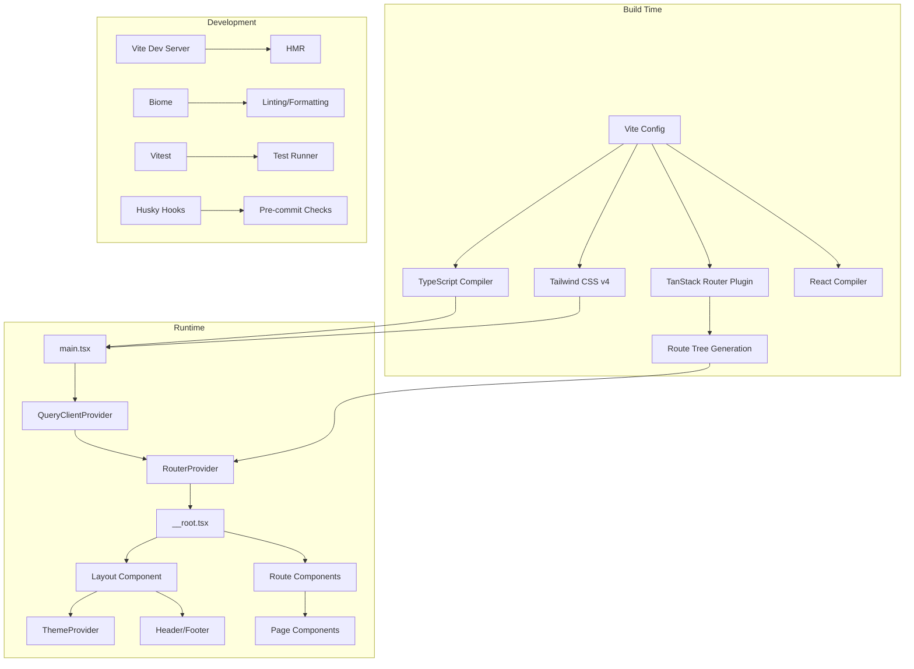
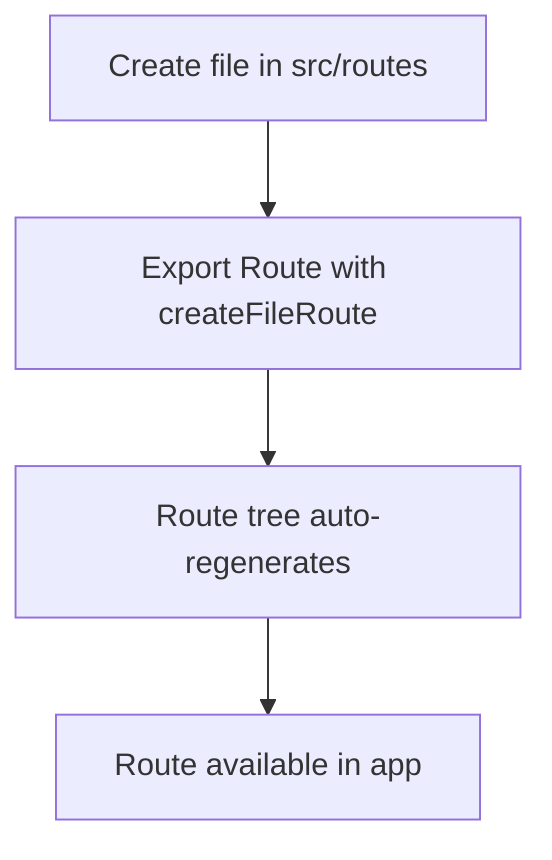
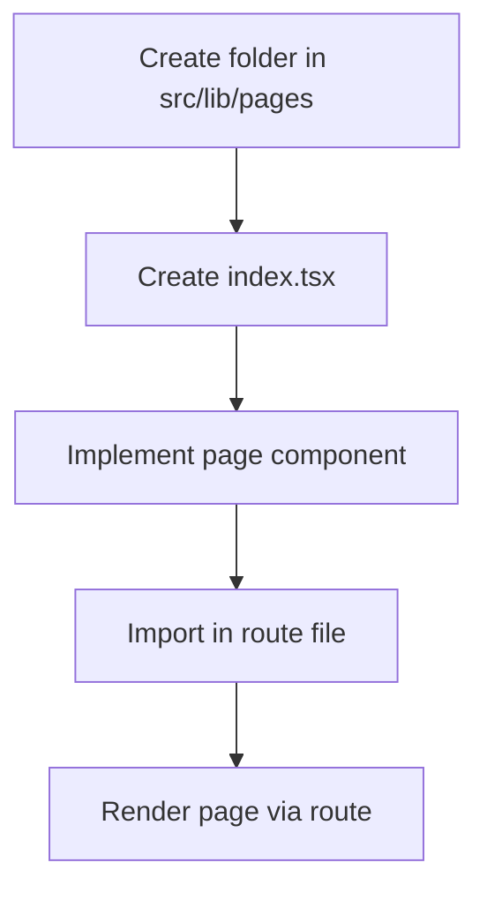
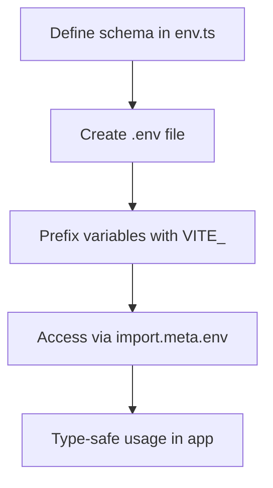

# Ecommerce client

## 🏗️ Architecture



### 🫀 Core Modules

| Module | Location | Responsibility |
|--------|----------|----------------|
| **Routing** | `src/routes/` | File-based route definitions, auto-generated route tree |
| **Pages** | `src/lib/pages/` | Page-level components organized by route |
| **Layout** | `src/lib/layout/` | Application shell (Header, Footer, Layout wrapper) |
| **Components** | `src/lib/components/` | Reusable UI components (ThemeProvider, ThemeToggle) |
| **Services** | `src/lib/services/` | Shared services and constants (QueryClient) |
| **Utils** | `src/lib/utils/` | Pure utility functions |
| **Styles** | `src/lib/styles/` | Global CSS and Tailwind configuration |

## 🚀 Tech Stack

### Core Dependencies

- **React**: UI library
- **Vite** (rolldown-vite): Build tool and dev server
- **TypeScript**: Type system
- **Tailwind CSS**: Utility-first CSS framework
- **TanStack Router**: Type-safe file-based routing
- **TanStack Query**: Server state management
- **Zod**: Runtime type validation

### Development Tools

- **Biome**: Linter and formatter
- **Husky**: Git hooks

### Build Plugins

- `@vitejs/plugin-react`: React support with Fast Refresh
- `@tanstack/router-plugin`: File-based route generation
- `@tailwindcss/vite`: Tailwind CSS v4 integration
- `@julr/vite-plugin-validate-env`: Environment variable validation
- `vite-plugin-checker`: TypeScript checking in dev mode

## 🏗️ Repository Structure

```
client/
├── infra/                        # Docker & Infrastructure configuration
│   ├── dev/                      # Development configuration
│   │   ├── Dockerfile            # Development Dockerfile (HMR)
│   │   └── docker-compose.yml    # Development compose
│   ├── prod/                     # Production configuration
│   │   ├── Dockerfile            # Production Dockerfile (Nginx)
│   │   └── docker-compose.yml    # Production-like compose
│   └── .dockerignore             # Docker ignore file
├── src/
│   ├── lib/
│   │   ├── components/          # Reusable UI components
│   │   │   ├── theme-provider.tsx
│   │   │   └── theme-toggle.tsx
│   │   ├── layout/              # Layout components
│   │   │   ├── components/
│   │   │   │   ├── header.tsx
│   │   │   │   └── footer.tsx
│   │   │   └── index.tsx
│   │   ├── pages/               # Page components
│   │   │   ├── 404/
│   │   │   └── home/
│   │   ├── services/             # Shared services
│   │   │   └── constants.ts
│   │   ├── styles/               # Global styles
│   │   │   └── globals.css
│   │   └── utils/                # Utility functions
│   │       ├── sample.ts
│   │       └── sample.test.ts
│   ├── routes/                   # TanStack Router routes
│   │   ├── __root.tsx           # Root route with layout
│   │   └── index.tsx            # Home route
│   ├── main.tsx                  # Application entry point
│   ├── routeTree.gen.ts         # Auto-generated route tree
│   └── env.d.ts                  # Environment type definitions
├── public/                       # Static assets
├── dist/                         # Build output
├── vite.config.ts                # Vite configuration
├── tsconfig.json                 # TypeScript configuration
├── biome.json                    # Biome linter/formatter config
├── vitest.config.ts              # Vitest test configuration
├── env.ts                        # Environment variable schema
└── package.json
```

## 👣 Getting Started

### Prerequisites

- **Node.js**: ^24.14.x (specified in `engines`)
- **Docker**: For containerized development and deployment
- **Docker Compose**: For managing multi-container setups

### Development

Start the dev environment with hot-reloading:

```bash
docker compose -f infra/dev/docker-compose.yml up -d --build
```

Available at `http://localhost:3000`.

### Testing

Run tests:

```bash
npm run test              # Run tests once
npm run test:ui           # Run tests with UI and coverage
npm run test:coverage     # Run tests with coverage report
```

### Code Quality

```bash
npm run biome:check       # Check code style and linting
npm run biome:fix         # Auto-fix code style issues
npm run type:check        # TypeScript type checking
```

## Configuration

### Environment Variables

Environment variables are validated at build time using Zod. Define your schema in `env.ts`:

```typescript
// env.ts
export default defineConfig({
  schema: {
    VITE_API_BASE_URL: z.string().optional(),
  },
});
```

Access variables in code with type safety:

```typescript
import.meta.env.VITE_API_BASE_URL
```

### Tailwind CSS

Tailwind CSS v4 is configured via the `@tailwindcss/vite` plugin. Global styles and customizations are in `src/lib/styles/globals.css`.

### Routing

Routes are defined as files in `src/routes/`. TanStack Router automatically generates the route tree. See [TanStack Router documentation](https://tanstack.com/router) for advanced patterns.

## Deployment

### Docker

Start the production build served by Nginx:

```bash
docker compose -f infra/prod/docker-compose.yml up -d --build
```
Available at `http://localhost:8080`.

## 👩‍🍳 Development Recipes

### 🔀 Adding a New Route



1. You create a file inside `src/routes/` (e.g., `about.tsx`)
2. In this file, you export a route using `createFileRoute.ts`
3. The system automatically updates the route tree
4. The new route is then available in the application

### 📄 Adding a New Page Component



1. The page is created in `src/lib/pages/`
2. The main component is located in `index.tsx`
3. Import and use in the corresponding route file

### 🌱 Adding Environment Variables



1. Add schema definition in `env.ts`
2. Create `.env` file with your variables (prefixed with `VITE_`)
3. Access via `import.meta.env.VITE_*` with full type safety

### 🔧 Git Workflow

- **Pre-commit**: Runs Biome formatting/linting on staged files
- **Pre-push**: Runs full check suite (biome, type-check, tests)
